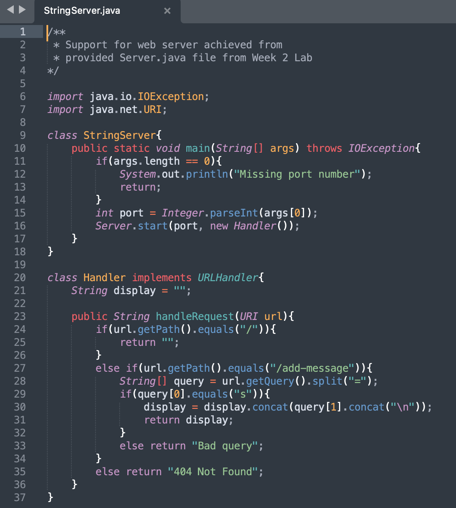
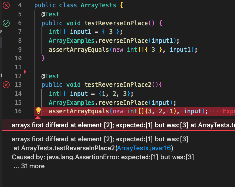

## Part 1


* *StringServer.java* determines the functionality/behavior of the web server by handling the url paths
* It is supported by the *Server.java* file from Week 2 Lab


* Both the main method of StringServer class and the handleRequest method of the Handler class are called
* The value 4000 is passed to the main method of the StringServer class when the StringServer.java was ran in the terminal
  * The value 4000 is actually saved as a string (in the args array)
  * We have to parse it into an int then it can be used as the port number
* The URI/URL ***http:/localhost:4000/add-message?s=greetings*** is then passed to the handleRequest method
* Then *greetings* in the path's query is concatenated into a string variable/field within the Handler class named *display*
* The newline escape character ("\n") is then concatenated to the *display* variable
* The *display* variable then becomes "greetings\n" and is displayed


* The handleRequest method is called
* The URL path ***http:/localhost:4000/add-message?s=testing%202nd%20line*** is passed to the handleRequest method 
* In url paths, spaces are designated by *$20*, so "testing 2nd line" is the string that is concatenated to the *display* variable
* The newline escape character is also concatenated again so any new addition will be on a new line
* The *display* variable then becomes "greetings\ntesting 2nd line\n" and is displayed to the screen

## Part 2

```java
@Test
public void testReverseInPlace2(){
  int[] input = {1, 2, 3};
  ArrayExamples.reverseInPlace(input);
  assertArrayEquals(new int[]{3, 2, 1}, input);
}
```
- The above code is a JUnit test that has a failure-inducing input

```java
@Test
public void testReverseInPlace(){
  int[] inupt = {3};
  ArrayExamples.reverseInPlace(input);
  assertArrayEquals(new int[]{3}, input);
}
```
- The above code is a JUnit test that doesn't induce a failure


- We can see that the input that doesn't induce a failure passed the JUnit test
- However, for the failure-inducing input, JUnit says that it expected the one of the elements to be the number 1 but saw 3 instead
- This means that our program returned [3, 2, 3] rather than [3, 2, 1]


- This is the code before the bug fix


* We can see that within the for loop, the conditional has changed from i < arr.length to i < arr.length / 2
  * This is because during each iteration the array mimicks "swapping" by assigning the first half of the array with values in the other half
  * Therefore, it only iterates through half of the array
* We add an int variable called *temp* to save the element that each iteration reassigns
  * When the first half of the array is reassigned to new values, their old values need to be saved in order to assign them to the back of the array
* This fix allows the method to iterate through the array a correct amount of time and properly swap values

## Part 3
* In week 3, I got to learn about a testing framework called JUnit. We had the chance to create some simple test cases in JUnit in order to test different methods that involve manipulating arrays and lists. Before week 3, the most accessible way to test methods/classes for me was to manually input different arguments at a time. Now I can make the test cases ahead of time in JUnit and then run them all at once. 
