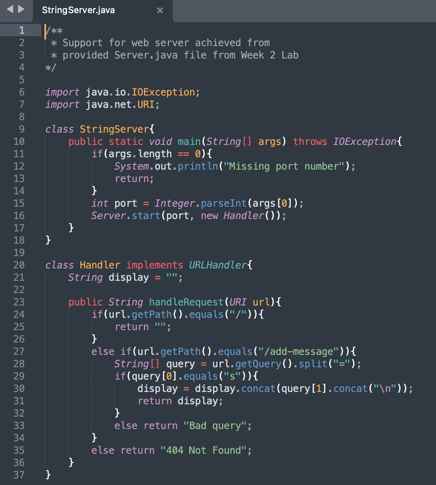
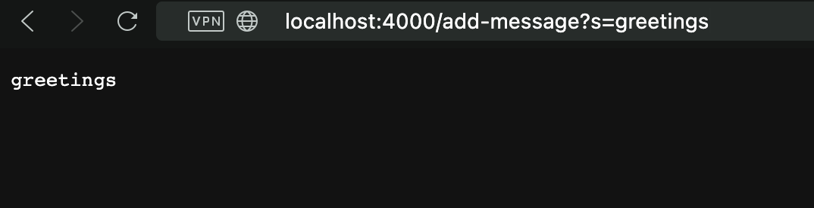
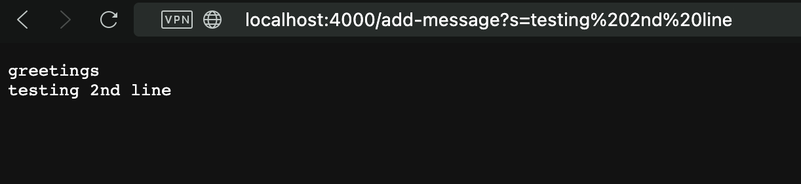

# _Lab Report 2_

## StringServer

- StringServer determines the functionality/behavior of the web server
- It is supported by the *Server.java* file from Week 2 Lab

* Both the main method of StringServer class and the handleRequest method of the Handler class are called
* 

-

## What I Learned

Week 2 lab was 
